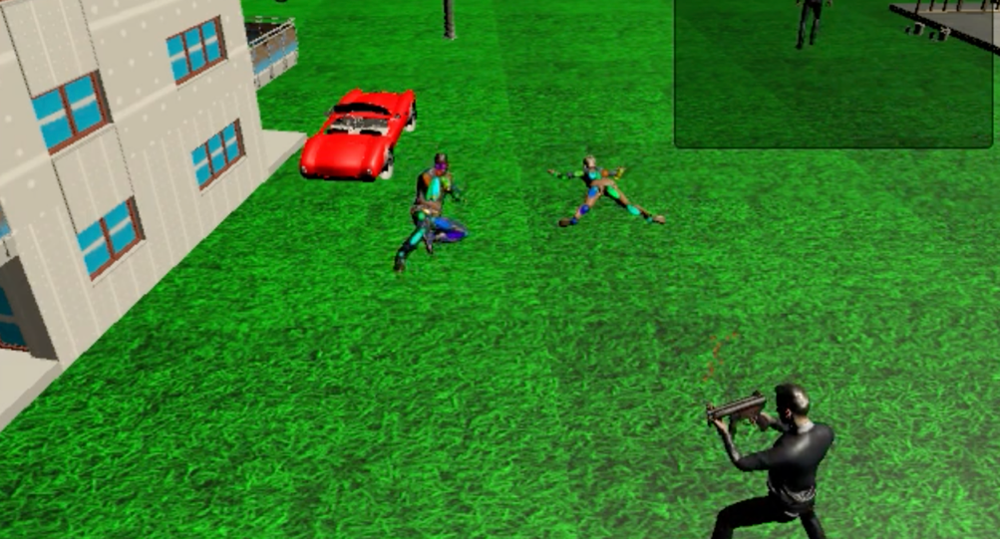

# Unity Scene Making & Dataset Generation

Unity is the most popular cross-platform game engine that packs a lot of features together and is flexible enough to create almost any game you can imagine. Thanks to a well-made graphical interface and the possibility of inserting C # scripts to control each object inside it, it is also possible to easily create "scenes" depicting everything we want.
In this context we are interested in the random generation of 3D scenes depicting three types of actions: "Hands Up", "Man Down" and "Waving Hands".

HANDS UP

MAN DOWN

The initial setup was possible thanks to:
https://github.com/FlavioLorenzi/com.unity.perception/blob/master/com.unity.perception/Documentation~/HPETutorial/TUTORIAL.md
Models found here:
https://free3d.com/it/3d-models/fbx
Animations found here:
https://www.mixamo.com

Each scene is characterized by a randomization of cameras (4 pov),texture and materials, objects, people and animations.

### Dataset Generation
This was possible thanks to linux xdotool (mousemove + click) that can automate the mouse movements and click to press the run button multiple times (given x,y and delay between clicks).

The final dataset is composed by 1000 samples for each camera (4) and for each activity (3) ==> 12k samples to split between train (80%) and val(20%). Furthermore another small dataset (for testing the trained networks) was collected, composed by 500x4x3 = 6k samples.
