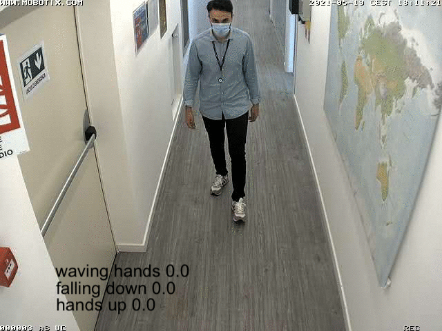
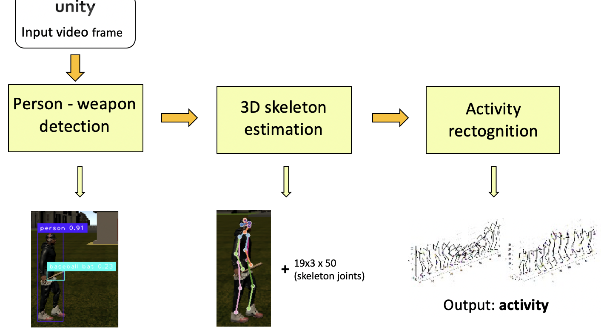
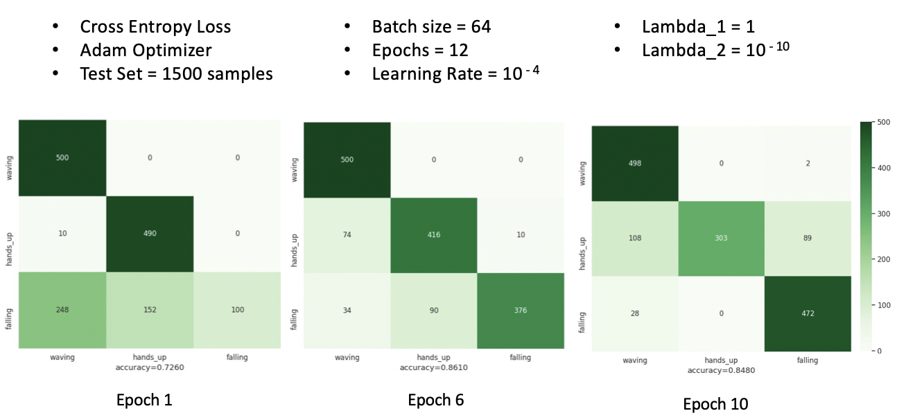
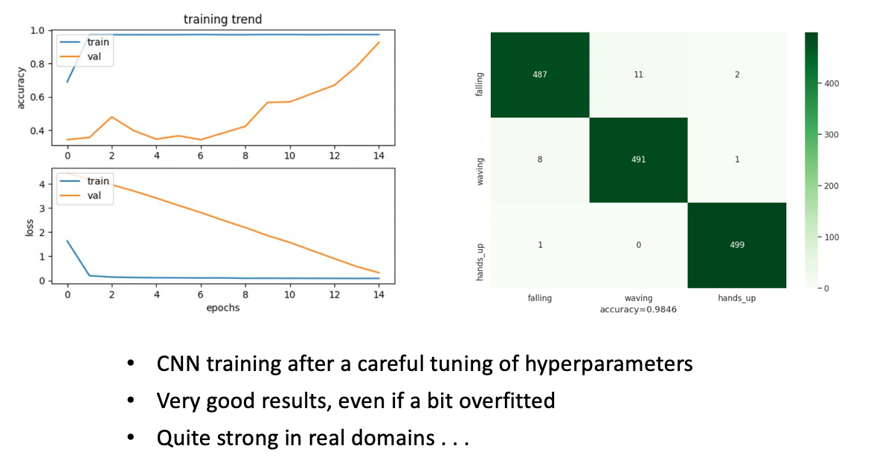
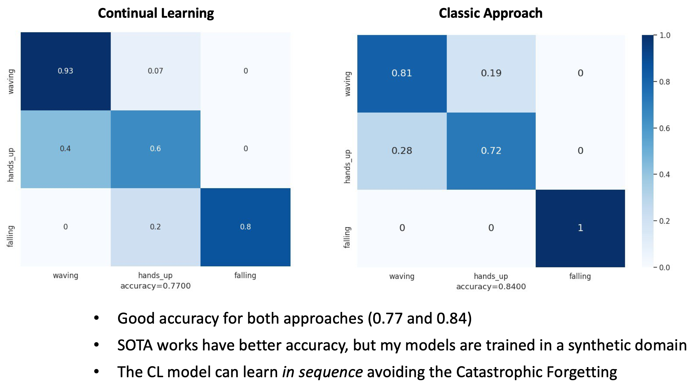

# Continual-Learning-on-Unity-dataset-exploiting-the-Activity-Recognition-Engine (Master thesis)
###
### DOC IN PROGRESS. . . 

  
 

___________________________________________________________

Copyright 2021 Konica Minolta Laboratory Europe (KMLE). All rights reserved.

No code available here: only high architecture, tools and results are shown
___________________________________________________________

Recognizing human actions is a challenging task and actively research in computer vision community. The task of Human Action Recognition (HAR) has grown more attention in many real-world applications such as video surveillance system, health care, sports analysis and smart home...

In this work we are interested to generate a model which generalize very well over different activities, trying to go beyond the state of art, implementing the innovative keypoints of Continual Learning techniques.

### First Part: dataset generation & ar engine setup

- [Unity](./Dataset_generation_using_Unity/ReadMe.md): scene making and synthetic dataset generation (C#)
- Real dataset retrieve
- [Activity Recognition Engine](./Activity_Recognition_Engine) setup: training and testing over real & synthetic dataset (Python), after [Tensorflow Serving](https://www.tensorflow.org/tfx/tutorials/serving/rest_simple) setup

### Second Part: CL implementation

- Continual learning (A): understanding how to set and apply this innovative approach (EWC vs catastrophic forgetting)
- Continuals learning (B): on-board implementing
- Continual learning (C): training models and see the results with synthetic dataset

### Third Part:

- Testing in real domain all models

Example of online prediction for Falling Down activity

 
 
## High level architecture

While for synthetic dataset the person detection and the bounding boxes are retrieved thanks to Perception Package (Unity Simulator for Computer Vision), in real domain we have not a 3D tool which labels for us: so I introduced YOLO object detection, implementing a filter for people and baseball bat only.

## Results
Continual Learning (CNN) with synthetic test-set

Classic Approach (CNN) with synthetic test-set

Continual Learning (CNN) with real test-set coming from my custom one plus UT-Kinect Action3D dataset (SOTA) from which I have extracted Waving Hands activity only. 

## System & prerequisites
Ubuntu==20.04; NVIDIA_CUDA-v11.0; CUDNN-v8.0; GEFORCE_RTX;

Python > 3.6;  Tensorflow-gpu==2; TF_Serving; Unity==17.04;

  

## Conclusion & Future Works

## References and Continuous Learning
[References folders and CL state of art](./References)

## Related Works
[Related Works](./img/relatedWorks.md)

